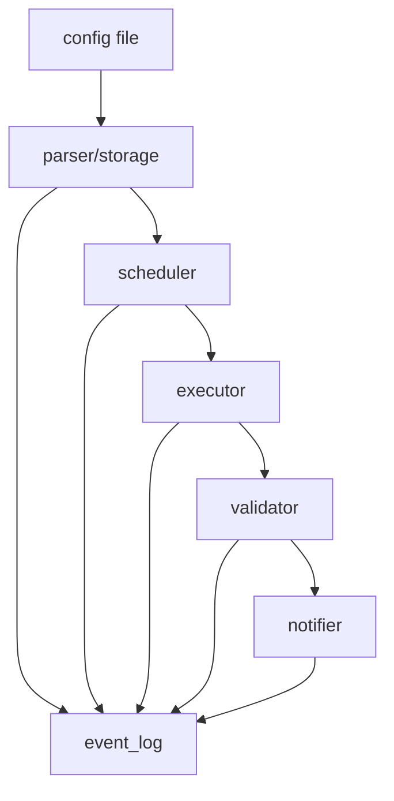

# Overview

Data ingestion is a common requirement that has a variety of approaches each
with advantages and shortcomings.

There are 2 main extremes...

## Point Solution Per Data Source

This is a great place to start before a collection of common patterns have been
established for the data team. Each data source has a custom solution with
limit or no module re-use between data sources.

Eventually the maintenance of this approach becomes difficult as requirements
become more complicated and inconsistency of approaches can arise due to lack
of code sharing / re-use.

An example of this is GUI based pipelines where is is natural to create a data
ingestion per source with the source system is accessed directly with custom
implementation.

## Metadata Driven Framework

The other extreme is generating data ingestion from configuration files. With
this approach the majority of work is creating complicated `YAML` configuration
files that may be specific to domains, but ingestion is standardised and most
data developers have no capacity to inject custom code.

Starting with this approach has a lot of overhead, but over time the trade-off
becomes worthwhile as more integration is required.

### Example Metadata File

```YAML
# Example configuration file

# Connectors
connectors:
  local_filesystem_raw: 
    type: filesystem
    base_path: raw
  local_filesystem_ingested: 
    type: filesystem
    base_path: ingested

# Data source metadata
data_sources:
  - domain: example
    name: customers
    source: 
      connector: local_filesystem_raw
      fqn_resource: customers.csv
      is_cdc: false
      primary_key: [id]
      timestamp_field: updated_at
    destination:
      connector: local_filesystem_ingested
      ordering: [id asc]
    schedule:
      cron: "0 * * * *"  # Run hourly
      random_offset: true
    validate:
      not_null: [id, name]
      unique: [id]
    fields:
      - label: id
        data_type: string
      - label: name
        data_type: string
      - label: age
        data_type: int
      - label: email
        data_type: string
      - label: updated_at
        data_type: timestamp
```

### High Level Architecture


